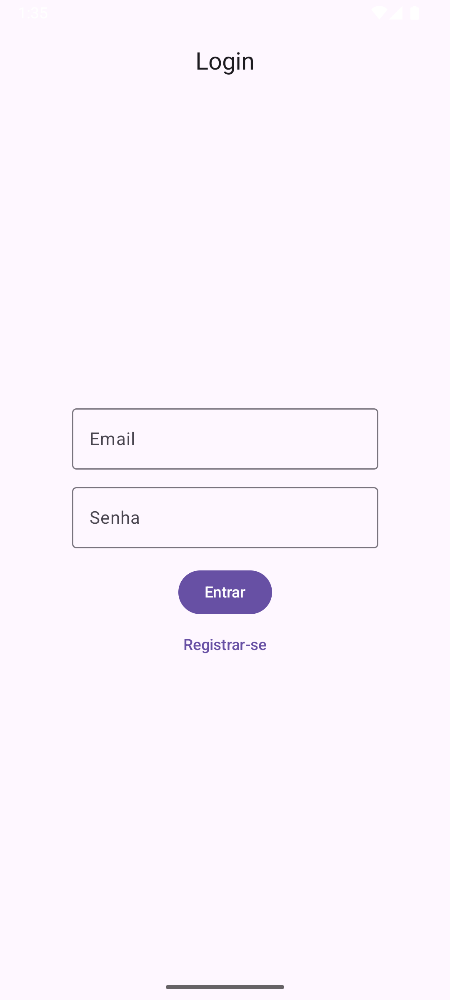

# AuthApp - Autenticação com Retrofit + Jetpack Compose

Entrega da atividade prática da disciplina **Desenvolvimento para Dispositivos Móveis** (UFC), utilizando arquitetura MVVM, Retrofit, Jetpack Compose e DataStore para autenticação de usuários via API REST.



## 📱 Funcionalidades

- Tela de login
- Tela de cadastro
- Tela protegida (home)
- Salvamento de token com DataStore
- Verificação automática de autenticação
- Navegação segura entre telas (Compose Navigation)

## 🧰 Tecnologias usadas

- [Jetpack Compose](https://developer.android.com/jetpack/compose)
- [Retrofit](https://square.github.io/retrofit/)
- [OkHttp Logging Interceptor](https://square.github.io/okhttp/)
- [DataStore Preferences](https://developer.android.com/topic/libraries/architecture/datastore)
- [Kotlin Coroutines](https://kotlinlang.org/docs/coroutines-overview.html)
- [StateFlow](https://developer.android.com/kotlin/flow/stateflow-and-sharedflow)

## 🔧 Instalação e execução

1. Clone este repositório:
   ```bash
   git clone https://github.com/nauancastro/AuthApp.git
   ```

2. Abra no Android Studio.

3. No `build.gradle` (App Module), certifique-se de incluir:

   ```groovy
   implementation "com.squareup.retrofit2:retrofit:2.9.0"
   implementation "com.squareup.retrofit2:converter-gson:2.9.0"
   implementation "com.squareup.okhttp3:logging-interceptor:4.9.3"
   implementation "androidx.navigation:navigation-compose:2.6.0"
   implementation "androidx.compose.material3:material3:1.1.0"
   implementation "androidx.lifecycle:lifecycle-viewmodel-compose:2.6.1"
   implementation "androidx.datastore:datastore-preferences:1.0.0"
   ```

4. Faça Sync Now e execute em um emulador ou dispositivo real.

## 🧪 Observação

Este projeto utiliza um endpoint base configurado como:

```kotlin
Retrofit.Builder()
  .baseUrl("https://sua-api.com/")
```

Altere para a URL real da sua API antes de rodar.
